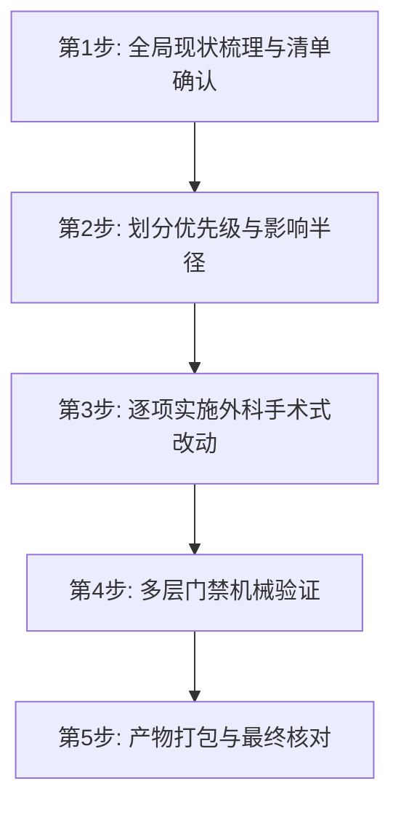

# 大型前端/扩展项目代码简化与重构实战手册（TypeScript + Vue3 / Pinia + WXT）

> 基于真实万行级浏览器扩展与前端应用重构实践沉淀，严格遵循「行为不变、零多余抽象、渐进验证」原则。

---

## 1. 适用场景与重构边界

### 何时使用
- 核心 Store / 服务代码膨胀（超过 500~1000 行），混杂了 UI 状态管理、网络流式请求、离线持久化与队列调度等多重职责；
- 迭代积累了多处结构完全相同的内存同步逻辑、定时清理定时器或重复过滤逻辑；
- 存在无意引入的死代码（覆盖赋值、不可达条件分支、已无调用点的单行包装函数）；
- 生产代码中残留调试诊断循环或未收窄的 `any` 错误捕获。

### 何时坚决不改（边界与红线）
- **绝不改动邻近无辜代码**：不借机"顺手格式化"、不改动现有无破坏的设计模式；
- **绝不引入未请求的过度设计**：不引入单次使用的工场、策略模式或无价值包装层；
- **绝不删除未理解目的的代码**：遵循 Chesterton's Fence，理解其存在原因后再行动；
- **绝不削弱错误处理**：不能为了"代码简洁"删减必填错误边界或降级机制。

---

## 2. 坏味道识别与外科手术式改动方案

### 2.1 状态与逻辑坏味道清单

| 坏味道特征 | 潜在风险 | 外科手术式改动方案 |
|---|---|---|
| **局部变量遮蔽 (Variable Shadowing)**<br>函数内 `let totalCollected = 0`<br>与 Store 顶层 `const totalCollected = computed(...)` | 编译期不报错，但后续重构或方法拆分时极易误取局部变量或覆盖响应式状态 | 将函数内部临时累加器/计数器重命名为具名业务变量（如 `batchCollected`），与暴露给外部的全局状态彻底解耦 |
| **内存状态同步散落**<br>实体 CRUD 方法中各自定义 5~10 行同步 `currentDoc` 与 `list` 的重复代码 | 修改同步策略或补充字段时需修改 N 处，易出现漏改导致 UI 显示不一致 | 提取局部工具函数 `_syncInMemory(id, data)`，各业务方法仅保留一行同步调用 |
| **高频异步流式回调中的 O(N) 线性查找**<br>在 `onToken`、`onReasoning` 回调中对每块 token 反复执行 `captured.find(id)` | 每次流式响应成百上千次 token chunk，产生大量无谓的线性查找开销 | 在回调闭包外直接操作已传入的目标对象引用（`targetMsg.content += text`），消除 O(N) 查找 |
| **分散的清理定时器**<br>多处业务流程各写 `setTimeout(() => { if (s?.phase === ...) clear() }, 8000)` | 超时时长或清理条件变更时需改动多处 | 提取 `scheduleStatusClear(id)` 统一定时器管理与清理条件 |
| **重复的数据集过滤算法**<br>ZIP 导出与 JSON 导出中各自手写 20+ 行日期与 ID 过滤 | 两处过滤规则可能随需求变动发生逻辑漂移 | 提取纯函数 `applyBatchFilter(items, filter)` 供两者共享 |
| **死赋值与不可达分支**<br>`pending = A; pending = B`<br>`if (sidePanel) { if (!sidePanel) ... }` | 意图丢失、误导维护者误以为存在备用降级分支 | 经上下文核对后直接删除死赋值与不可达条件，保持控制流清晰透明 |
| **异常捕获弱类型**<br>`catch (e: any) { onError(e) }` | 隐藏类型安全漏洞，破坏严格类型检查 | 统一规范为 `catch (e: unknown) { onError(e instanceof Error ? e : new Error(String(e))) }` |

---

## 3. 标准重构工作流（5 步闭环）



### 步骤 1：全局现状梳理
1. 检查当前分支与未提交变更：`git status -s`；
2. 梳理文件行数、复杂度与责任边界，按 High（可靠性/潜在Bug）、Medium（可读性/重复）、Low（规范细节）三档分类列出改动清单；
3. 输出明确的实现计划并冻结范围，不随意扩大改动面。

### 步骤 2：核心逻辑拆分与下沉（可选）
- 若 Store 文件过大（>1000行），将不依赖 Vue/Pinia 响应式系统的大块核心引擎（如模型通信、流式处理、消息队列）下沉为纯 TypeScript 模块（如 `services/conversation/engine.ts`）；
- Store 仅保留状态管理与事件桥接，通过注入回调机制与纯引擎解耦。

### 步骤 3：逐项实施与原子替换
- 每次仅针对一个明确目标进行修改（如先修死代码，再合重复逻辑，最后调类型规范）；
- 编辑长文件时保持警惕：精确指定目标替换块的上下文锚点，避免吞没相邻的其它监听或业务逻辑。

### 步骤 4：多层门禁机械验证（关键）
每步或每组改动后执行分层验证：

```bash
# 1. 严格类型检查门禁（拦截所有类型破坏与潜在 undefined 访问）
pnpm compile
# 或 vue-tsc --noEmit

# 2. 针对改动模块运行独立单元测试
npx vitest run stores/document.store.test.ts
npx vitest run utils/conversation-export.test.ts
npx vitest run services/ai/openai-compatible.test.ts

# 3. 生产打包门禁（确保 Rollup / Vite / WXT 正常生成打包产物）
pnpm build
```

---

## 4. 实战踩坑与经验指纹

### 1. Windows 环境下 JSDOM 单元测试初始化长时停顿
- **现象**：在 Windows 上运行 `npx vitest run <file>`，控制台在 `RUN v4.1.9` 处可能停顿 40~50 秒无任何输出，容易被误判为死锁或挂起。
- **根因**：Vitest 的 `environment: 'jsdom'` 在 Windows 下首次加载大依赖包（如 fake-indexeddb、DOMPurify、jsdom 等）存在较重的文件系统加载开销。
- **排查手段**：先挑选一个零外部 DOM 依赖的极简工具测试（如 `utils/date.test.ts`）单独运行，观察 Duration 中的 `environment` 耗时分解；确认耗时在 environment 之后便可正常等待完整测试完成。

### 2. 代码块替换中的「相邻逻辑丢失」防御
- **教训**：在长入口脚本（如 `background.ts`）中合并两个相隔较远的监听器时，若选取的替换起始与结束行范围过大，容易将夹在中间的独立周期任务（如 `alarms.onAlarm`）误删。
- **对策**：修改后立即运行 `git diff` 审查修改的行数统计；若删除行数明显超出预期（如预期删 20 行却删除了 80 行），立刻复查 diff 恢复丢失的代码段。
